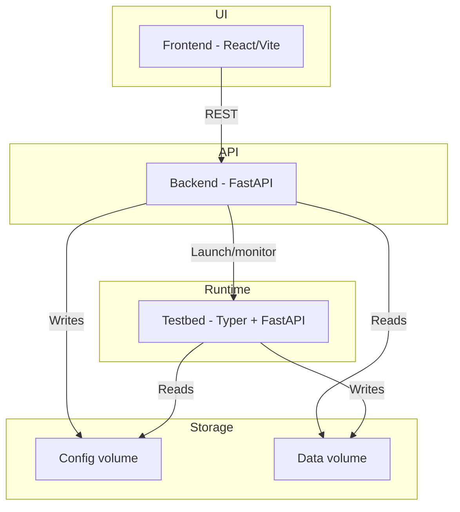

# Installation & Quick Start

## 1. Prerequisites

Before running the platform with Docker, ensure the following are
installed:

-   **Docker 24+**
-   **Docker Compose V2**
-   **20 GB free disk space**

## 2. Clone the repository

``` bash
git clone https://github.com/JoeTheHammer/rl-building-control.git
cd rl-building-control

```

## 3. Start the entire system

Create a `.env` file in the project root before starting Docker Compose. This file is used by `docker-compose.yml` to wire the frontend to the backend, generate TensorBoard links, and extend backend CORS settings.

Example:

```dotenv
BACKEND_HOST=http://localhost:8000
TESTBED_HOST=testbed
TENSORBOARD_HOST=localhost
CORS_ALLOW_ORIGINS=http://localhost:5173
# Optional:
# CORS_ALLOW_ORIGIN_REGEX=
```

What to update when you use the `.env` file:

- `BACKEND_HOST`: Address the frontend should call. For remote access use `http://<your-host>:8000`.
- `TENSORBOARD_HOST`: Hostname or IP that should appear in TensorBoard links opened from the UI.
- `CORS_ALLOW_ORIGINS`: Comma-separated list of frontend origins allowed to call the backend. Add the remote UI origin here.
- `TESTBED_HOST`: Keep `testbed` for Docker Compose. Change it only when you run the backend outside Docker and need it to call a separately started testbed instance.

The `.env` file does not update YAML configuration paths. When you move configs between machines or between Docker and local execution, update the path fields inside the YAML files as needed:

- `config/experiments/*.yaml`: `environment_config`, `controller_config`
- `config/environments/*.yaml`: `building_model`, `weather_data`

``` bash
docker-compose up --build
```

Services: 
- Frontend: http://localhost:5173 
- Backend: http://localhost:8000
- Testbed: http://localhost:8001


Stop:

``` bash
CTRL + C
docker-compose down
docker-compose down -v   # wipe volumes
```

## 4. Remote access

If you want to access the system remotely, update the `.env` file in the project root before starting the stack. The hostnames and origins must match the machine from which users will open the UI.

Typical remote changes:

- `BACKEND_HOST=http://<server-or-dns-name>:8000`
- `TENSORBOARD_HOST=<server-or-dns-name>`
- `CORS_ALLOW_ORIGINS=http://<server-or-dns-name>:5173`

If you keep everything on the same machine and open it locally, the example `.env` values above are sufficient.

------------------------------------------------------------------------

# System overview

## Purpose

This repository hosts a complete reinforcement-learning platform for
building control.

-   **Testbed runtime** -- executes experiment suites via
    [Sinergym](https://github.com/ugr-sail/sinergym)/EnergyPlus.
-   **Backend API** -- manages configurations, experiments, TensorBoard.
-   **Frontend UI** -- configure experiments, monitor progress, analyze
    results.

## Architecture overview



## Component responsibilities

-   Frontend: React dashboard, configuration creation, analytics views.
-   Backend: REST API, suite orchestration, YAML config handling.
-   Testbed: CLI + FastAPI service for experiment execution.
-   Volumes: `config/` and `data/` shared across backend & testbed.

## Repository structure

    backend/      FastAPI orchestration service
    config/       YAML configs
    data/         Experiment results, Environment data (building model, weather data)
    docs/         Documentation (in progress)
    frontend/     React UI
    testbed/      Sinergym runtime
    docker-compose.yml

## Running locally

### Backend

``` bash
cd backend
pipenv install --dev
pipenv run uvicorn main:app --app-dir src --reload
```

### Testbed

``` bash
cd testbed
pipenv install --dev
pipenv run uvicorn api.api:app --app-dir src --port 8001
pipenv run python src/main.py config/experiments/<suite>.yaml
```

### Frontend

``` bash
cd frontend
npm install
npm run dev
```

When running the frontend locally without Docker, use `frontend/.env.local` to set `VITE_BACKEND_URL`. This is separate from the root `.env` file used by Docker Compose.

## Extending the system

-   Add environments via `testbed/src/environments/`
-   Add controllers via `testbed/src/controllers/`
-   Add backend endpoints under `backend/src/api/`
-   Add frontend routes under `frontend/src/lib/routes.tsx`

When more information about adding additional controllers or enviornments can be found in the README of the testbed (testbed/README) or in the [user guide](docs/user-guide/04-extending-the-system.md). 

# User Guide

A user guide can be found here: 

- [Experiment Configuration](docs/user-guide/01-experiment-configuration.md)
- [Running Experiments](docs/user-guide/02-running-experiments.md)
- [Data Analysis](docs/user-guide/03-data-analysis.md)
- [Extending the system](docs/user-guide/04-extending-the-system.md)
