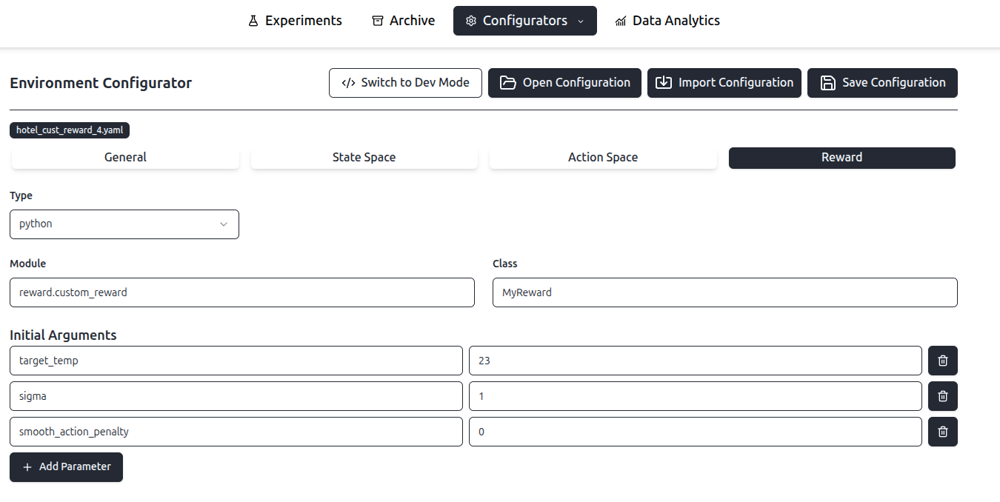
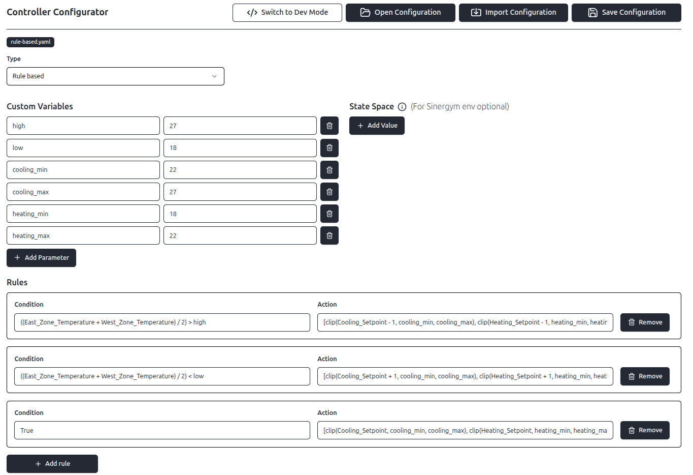

# Overview

Experiment configuration relies on `.yaml` files. To define an experiment, the following components are required:

-   **Controller config** (`.yaml`)
-   **Environment config** (`.yaml`)
-   **Experiment config** (`.yaml`)
-   **Building model** (`.epJSON`)
-   **Weather data** (`.epw` and `.ddy` files)

The building model and weather data must be provided by the user as external assets. The configuration files, however, can be either authored manually or generated automatically using the Frontend interface.

# Configuration with Frontend

To access the frontend, start the application via Docker (see README in project root) and access `http://localhost:5173/`.

## Environment Configuration

In the menu bar at the top, navigate to `Configurators` / `Environment`. The following screen will be displayed:


At the top, there is a bar with several options:

- **Switch to Dev Mode**: Opens the plain YAML file that represents the current configuration. Users can switch between Dev Mode and GUI mode without losing progress; changes are reflected in both views.
- **Open Configuration**: Opens a dialog to load a previously created environment configuration.
- **Import Configuration**: Allows users to import a configuration from the local file system into the project.
- **Save Configuration**: Saves the current configuration to the system.

### General

In the **General** tab, general environment properties can be configured:

- **Building Model**: Click `Select Building Model` to choose a building model (`.epJSON` files) from the `data/environment/buildings` directory.
- **Weather Data**: Click `Select Weather Data` to choose weather data from the `data/environment/weather` directory. Each weather data folder must contain both a `.ddy` and an `.epw` file.
- **Start Date Episode**: Selects the start date for each experiment episode.
- **End Date Episode**: Selects the end date for each experiment episode.
- **Timesteps per hour**: Defines the number of simulated timesteps per hour.

At the bottom of the configuration, weather variability can be defined using an [Ornstein Uhlenbeck noise](https://en.wikipedia.org/wiki/Ornstein%E2%80%93Uhlenbeck_process) process. The parameters sigma, mu, and tau specify the noise characteristics, where sigma controls the magnitude of the stochastic fluctuations, mu defines the long term mean, and tau determines how aggressively the noise evolves over time. The variable key must reference a valid weather variable provided by the selected weather data.

### State Space

The **State Space** tab allows for the configuration of the state space. At the top, users can specify whether to include time information and, if so, which components to include. Additionally, cyclic time representation can be enabled. More information on cyclic data handling can be found [here](https://towardsdatascience.com/how-to-handle-cyclical-data-in-machine-learning-3e0336f7f97c/).

In the `Variables` section, the variables comprising the state space are defined. These are mapped to a Sinergym state space and must correspond to output variables in the `epJSON` EnergyPlus building model file. Further details can be found [here](https://ugr-sail.github.io/sinergym/compilation/main/pages/environments).

The following fields must be specified:
- **Variable Name**: The internal identifier used within the platform for this variable.
- **The type**: Select either `Variable` or `Meter`. If `Meter` is selected, only the meter name is required. If `Variable` is selected, both the EnergyPlus Name and the Zone must be provided.
- **EnergyPlus Name**: The variable name as defined in EnergyPlus. This must match exactly for the framework to function correctly.
- **Zone**: The EnergyPlus Zone (or object) containing the variable. This must map to the `key_value` field in the `epJSON` building model's output variables.
- **Exclude from state space**: If this option is selected, the variable's value is excluded from the agent's state space but remains available in the recorded dataset.

Variables can be added or removed using the corresponding buttons:


### Action Space

The **Action Space** tab allows for the definition of actuators. These are mapped to a Sinergym action space and must exist in the `epJSON` EnergyPlus building model file. More information can be found [here](https://ugr-sail.github.io/sinergym/compilation/main/pages/environments).

The following fields must be specified:

- **Actuator Name**: The internal identifier used within the platform for this actuator.
- **Component**: The EnergyPlus component name.
- **Control Type**: The EnergyPlus control type.
- **Actuator Key**: The EnergyPlus key for this actuator.
- **Type**: Select either `Continuous` or `Discrete`.
    - **Continuous**: Define `Min` and `Max` values. The agent will apply a value within the continuous range [min, max] at each timestep. Values outside this range will be clipped.
    - **Discrete**: Choose between `Values` or `Ranges` mode.
        - **Values**: Provide a specific list of values from which the agent can choose.
        - **Ranges**: Define `Min`, `Max`, and a step size. For example, min=20, max=21, step=0.2 results in the set [20, 20.2, 20.4, 20.6, 20.8, 21].

An example action space configuration is shown below:


### Reward

There are two methods for configuring rewards: **Expression** or **Python**. Select the desired method from the `Type` dropdown menu.

#### Expression Reward

In the `Variables` section, list the state space variable names to be used. These values will be updated at each timestep for reward calculation.

In the `Parameter` section, define custom parameters. These values remain constant and are available to the reward function at each timestep.

Finally, define a custom mathematical formula in the `Expression` section using the variables and parameters.

The expression uses **Python-like syntax** and is safely evaluated using the **[asteval](https://newville.github.io/asteval/)** library. Standard arithmetic operators (`+`, `-`, `*`, `/`, `**`) and parentheses are supported.

The following functions are available for use in formulas:

- **Standard Math**: `abs(x)`, `min(a, b)`, `max(a, b)`, `exp(x)`, `sqrt(x)`
- **Numpy Utilities**: `clip(value, min, max)`
- **Custom Logic**: `within(x, start, end)`
  - *Description*: Checks if `x` is between `start` and `end`.
  - *Wrap-around*: Automatically handles wrap-around ranges (e.g., `within(month, 11, 2)` returns True for Nov, Dec, Jan, Feb).

**Example:**
To penalize energy consumption while keeping temperature within comfortable bounds (20°C to 24°C):

```python
-1.0 * energy_consumption + (10.0 if within(zone_temp, 20, 24) else -10.0)
```

Example of an expression reward configuration:


#### Python Reward

To overcome the limitations of expression rewards, custom Python rewards can be used. Specify the Python module name and the class name of the reward implementation. Furthermore, you can define Initial Arguments that are passed to the custom reward class. For details on adding a custom reward, refer to [Extending the System](04-extending-the-system#custom-reward.md).




### Example YAML File

```yaml
building_model: >-
  /home/johannes/workspace/rl-building-control/data/environment/buildings/2ZoneDataCenterHVAC_wEconomizer.epJSON
weather_data: >-
  /home/johannes/workspace/rl-building-control/data/environment/weather/ny_jfkl/USA_NY_New.York-J.F.Kennedy.Intl.AP.744860_TMY3.epw
state_space:
  variables:
    Outdoor Temperature:
      name: Site Outdoor Air Drybulb Temperature
      zone: Environment
    East_Zone_Temperature:
      name: Zone Air Temperature
      zone: East Zone
    Outdoor Humidity:
      name: Site Outdoor Air Relative Humidity
      zone: Environment
    Wind Speed:
      name: Site Wind Speed
      zone: Environment
    Diffuse Solar Radiation:
      name: Site Diffuse Solar Radiation Rate per Area
      zone: Environment
    Direct Solar Radiation:
      name: Site Direct Solar Radiation Rate per Area
      zone: Environment
    West_Zone_Temperature:
      name: Zone Air Temperature
      zone: West Zone
    East Humidity:
      name: Zone Air Relative Humidity
      zone: East Zone
    West Humidity:
      name: Zone Air Relative Humidity
      zone: West Zone
    West Mean Radiant Temp:
      name: Zone Thermal Comfort Mean Radiant Temperature
      zone: West Zone PEOPLE
    East Mean Radiant Temp:
      name: Zone Thermal Comfort Mean Radiant Temperature
      zone: East Zone PEOPLE
    Fanger West:
      name: Zone Thermal Comfort Fanger Model PPD
      zone: West Zone PEOPLE
    Fanger East:
      name: Zone Thermal Comfort Fanger Model PPD
      zone: West Zone PEOPLE
    People Air Temp West:
      name: People Air Temperature
      zone: West Zone PEOPLE
    People Air Temp East:
      name: People Air Temperature
      zone: East Zone PEOPLE
    East Zone People:
      name: Zone People Occupant Count
      zone: East Zone
    West Zone People:
      name: Zone People Occupant Count
      zone: West Zone
    Facility_Total_HVAC_Electric_Demand_Rate:
      name: Facility Total HVAC Electricity Demand Rate
      zone: Whole Building
    Cooling_Setpoint:
      name: Zone Thermostat Cooling Setpoint Temperature
      zone: West Zone
    Heating_Setpoint:
      name: Zone Thermostat Heating Setpoint Temperature
      zone: West Zone
    Fanger Model Clothing Value:
      name: Schedule Value
      zone: Clothing Sch
  time_info:
    day_of_month:
      cyclic: false
    month:
      cyclic: true
    day_of_week:
      cyclic: false
    hour:
      cyclic: false
action_space:
  actuators:
    Cooling Setpoint:
      type: continuous
      range:
        - 22
        - 30
      component: Schedule:Constant
      control_type: Schedule Value
      actuator_key: Cooling Setpoint RL
    Heating Setpoint:
      type: continuous
      range:
        - 15
        - 22
      component: Schedule:Constant
      control_type: Schedule Value
      actuator_key: Heating Setpoint RL
reward_function:
  type: expression
  variables:
    - East_Zone_Temperature
    - West_Zone_Temperature
    - Facility_Total_HVAC_Electric_Demand_Rate
  expression: >-
    - energy_weight * lambda_energy * Facility_Total_HVAC_Electric_Demand_Rate -
    (1 - energy_weight) * lambda_temperature * (max(0, ((East_Zone_Temperature +
    West_Zone_Temperature) / 2) - comfort_high) + max(0, comfort_low -
    ((East_Zone_Temperature + West_Zone_Temperature) / 2)))
  params:
    energy_weight: 0.5
    lambda_energy: 0.00005
    lambda_temperature: 1
    comfort_high: 27
    comfort_low: 18
episode:
  timesteps_per_hour: 4
  period:
    - 1
    - 1
    - 2025
    - 31
    - 12
    - 2025
```

## Controller Configuration

In the menu bar at the top, navigate to `Configurators` / `Controller`. The following screen will be displayed:


The controls for switching to Dev Mode, opening, importing, and saving configurations function identically to those in the Environment Configurator.

Three types of controllers are available: **Reinforcement Learning**, **Rule Based**, and **Custom**.

### Reinforcement Learning Controller

#### Training Options

The following training options can be configured:

- **Total Training Timesteps**: The total number of timesteps the agent will execute during the training phase.
- **Report Training**: If selected, data is collected during training and included in the final dataset.
- **Denormalize**: If state or action normalization is enabled, this option controls whether the values stored in the final dataset are denormalized.
- **Tensorboard Logs**: If selected, training data is sent to [TensorBoard](https://www.tensorflow.org/tensorboard) for monitoring. TensorBoard can be accessed to view live training metrics. More information is available [here](02-running-experiments.md).

#### Hyperparameter Tuning

If `Activate Hyperparameter tuning` is selected, hyperparameter tuning using [Optuna](https://optuna.org/) is enabled. The following options must be specified:

- **Num episodes**: Total number of episodes used for evaluation during hyperparameter tuning.
- **Num trials**: The number of different trials to run during hyperparameter tuning.
- **Sampler**: Select the [sampler used by Optuna](https://optuna.readthedocs.io/en/stable/reference/samplers/index.html). Options include `TPE`, `Random`, `Grid`, `CMAES`, and `NSGAII`. Note that the chosen RL algorithm must support hyperparameter tuning. Refer to [Tunable RL Controller](04-extending-the-system#tunable-rl-controller.md) for more details.
- **Training timesteps**: The total number of training timesteps used during hyperparameter tuning.

#### Environment Wrapper

Different environment wrappers can be selected:

- **Normalize state**: Normalizes the state space.
- **Normalize reward**: Normalizes the reward value.
- **Normalize action**: Normalizes the action space.
- **Continuous action**: Specifies if the action space is continuous. Must be selected for controllers supporting continuous action spaces.
- **Discrete action**: Specifies if the action space is discrete. Must be selected for controllers supporting discrete action spaces (e.g., DQN).

#### Hyperparameters

Allows for the specification of hyperparameter names and values. Nested hyperparameters can be defined using dot notation, for example, `policy_kwargs.squash_output`.

#### Example

Below is an example configuration for an A2C reinforcement learning controller.


Example YAML file:

```yaml
training:
  report_training: false
  report_denormalized_state: false
  tensorboard_logs: true
  timesteps: 300000
environment_wrapper:
  normalize_state: true
  normalize_reward: false
  normalize_action: true
  continuous_action: true
  discrete_action: false
hyperparameters:
  tensorboard_log: logs/
  ent_coef: 0.01
  learning_rate: 0.00005
  n_steps: 512
  gae_lambda: 0.95
  vf_coef: 0.5
  policy_kwargs.squash_output: true
```

### Rule-based Controller

For rule-based controllers, the following configuration is required:

- **Custom Variables**: A list of key-value pairs that can be referenced in rules and actions.
- **State Space**: If **NOT** using a Sinergym environment, all state space variable names must be added here. Currently, the platform supports only Sinergym environments, so **this section can be left empty**.
- **Rules**: Conditions and actions must be provided using **Python-like syntax**, safely evaluated via the **[asteval](https://newville.github.io/asteval/)** library.
    - **Condition**: An expression that evaluates to a boolean value.
    - **Action**: The action returned and sent to the actuators if the condition evaluates to `true`. Ensure the action dimensions match the action space.

#### Examples



Resulting YAML file:

```yaml
custom_variables:
  high: 27
  low: 18
  cooling_min: 22
  cooling_max: 27
  heating_min: 18
  heating_max: 22
rules:
  - condition: ((East_Zone_Temperature + West_Zone_Temperature) / 2) > high
    action: >-
      [clip(Cooling_Setpoint - 1, cooling_min, cooling_max),
      clip(Heating_Setpoint - 1, heating_min, heating_max)]
  - condition: ((East_Zone_Temperature + West_Zone_Temperature) / 2) < low
    action: >-
      [clip(Cooling_Setpoint + 1, cooling_min, cooling_max),
      clip(Heating_Setpoint + 1, heating_min, heating_max)]
  - condition: 'True'
    action: >-
      [clip(Cooling_Setpoint, cooling_min, cooling_max), clip(Heating_Setpoint,
      heating_min, heating_max)]
```

### Custom Controller

To support custom implementations, a user-defined controller class can be used. Specify the Python module name and class name. Additionally, key-value pairs can be defined in `init arguments` to be passed to the controller's constructor.

For details on adding a custom controller, refer to [Extending the System](04-extending-the-system.md#custom-controller).

Example YAML file:

```yaml
class_name: MyCustomController
module: controllers.custom.my_custom_controller
args:
  factor: 1
  lower_bound: 20
  upper_bound: 25
```

## Experiment Suite Configuration

In the menu bar at the top, navigate to `Configurators` / `Experiment`. The controls for Dev Mode, opening, importing, and saving experiment suites function identically to those in the environment and controller configurators.

Experiments can be added to or removed from a suite using the corresponding buttons, as shown below:


For each experiment, the following settings can be configured:

- **Name**: The internal name of the experiment.
- **Engine**: The simulation engine. Currently, the only supported engine is [Sinergym](https://github.com/ugr-sail/sinergym).
- **Environment config**: The `.yaml` configuration file for the environment.
- **Controller**: The type of controller. For Reinforcement Learning controllers, this corresponds to the model used. Available types include:
    - Custom
    - Random (selects random actions)
    - Rule Based
    - SAC
    - PPO
    - Recurrent PPO
    - A2C
    - DQN
    - DDPG
    - TD3
- **Controller Config**: The `.yaml` configuration file for the controller. Ensure that the hyperparameters in the file match those supported by the chosen RL model.
- **Episodes**: The number of episodes used for evaluation.
- **Seed (optional)**: Integer seed applied per experiment. If set, it is used for global RNGs (for example `random`, `numpy`, PyTorch when available) and controller/environment seedable components.
- **Denormalize State in collected data**: If selected, denormalized state and action space values will be recorded during evaluation. Enabling this option is recommended.

### Example Config

Using the GUI:


Resulting `.yaml` file:

```yaml
experiments:
  - name: dqn-experiment
    engine: sinergym
    environment_config: sinergym-data-center.yaml
    controller: dqn
    controller_config: dqn_controller.yaml
    episodes: 1
    reporting:
      denormalize_state: true
  - name: ppo-experiment
    engine: sinergym
    environment_config: sinergym-data-center.yaml
    controller: ppo
    controller_config: ppo_controller.yaml
    episodes: 2
    seed: 42
    reporting:
      denormalize_state: true
```

# Configuration without Frontend

Configuration `.yaml` files can also be created manually without using the frontend. The experiment suite can then be executed using the testbed as described [here](../../testbed/README.md).
