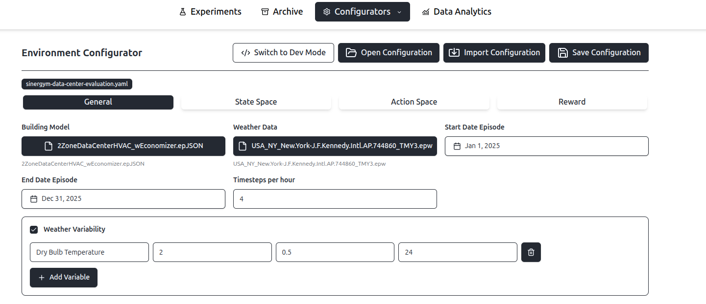
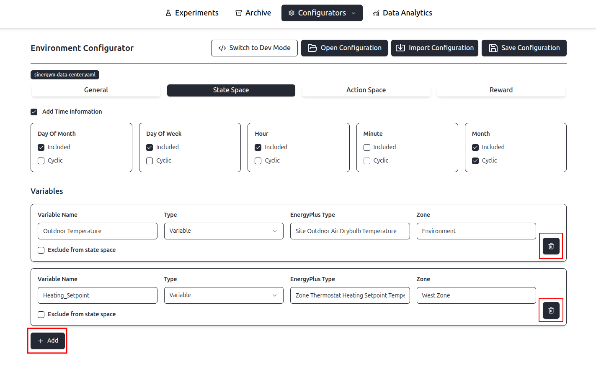
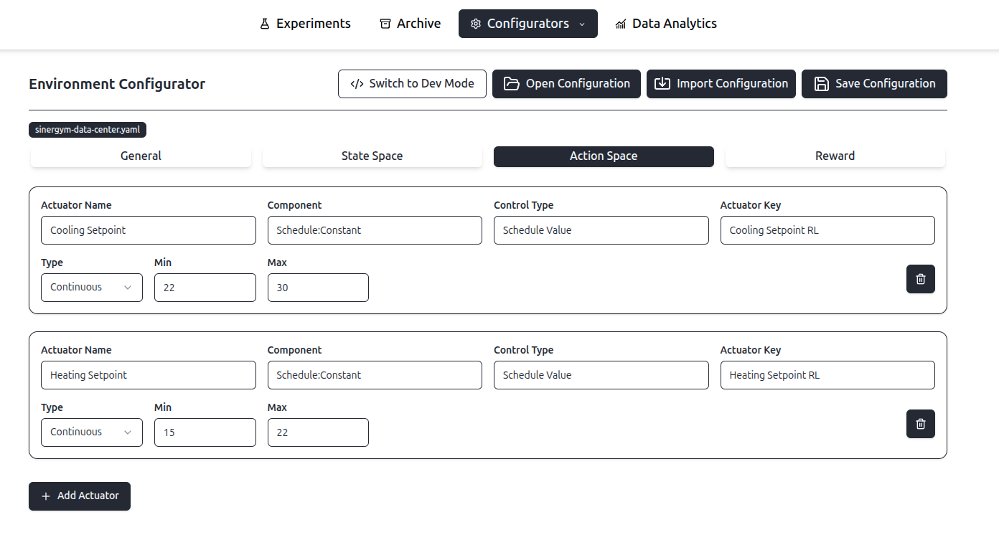
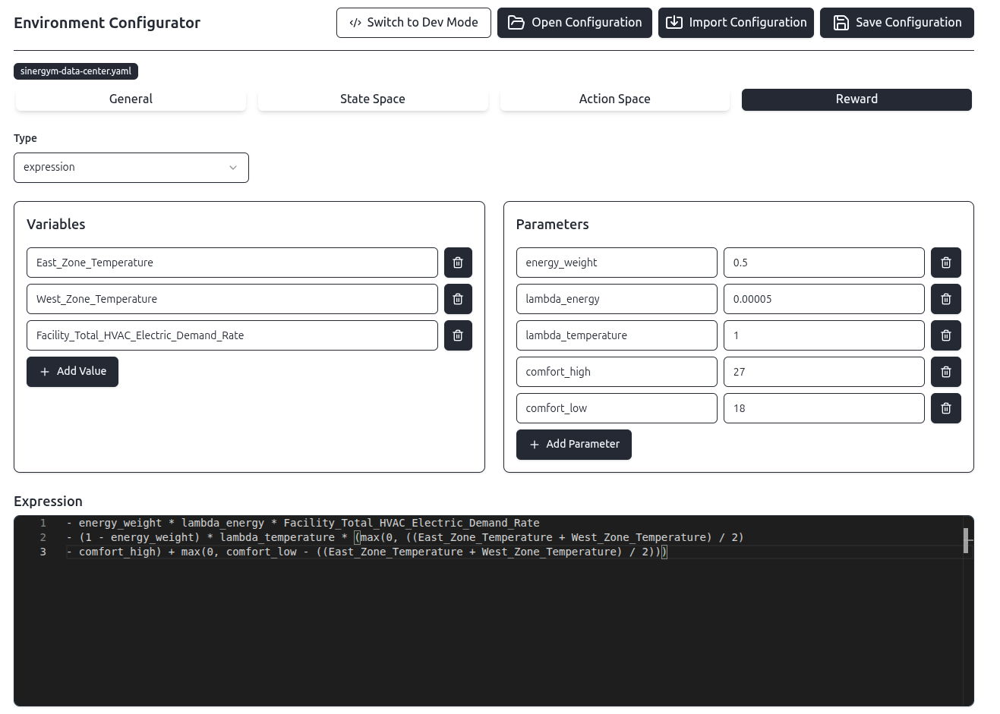
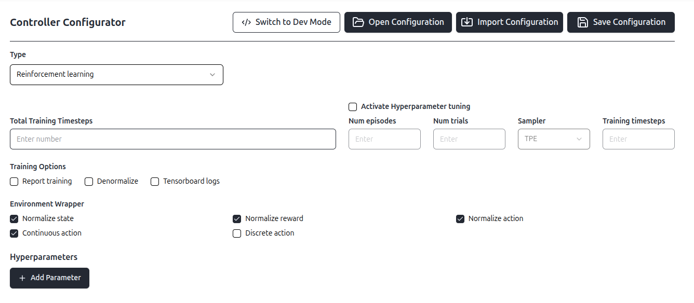
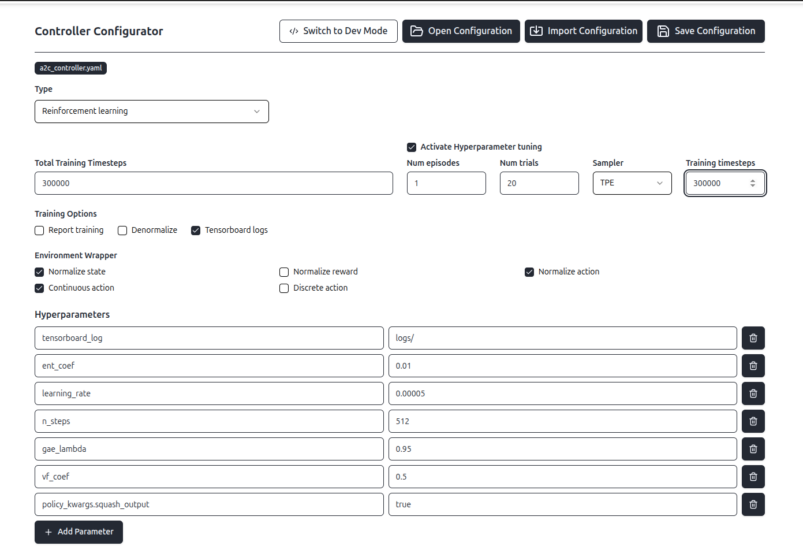
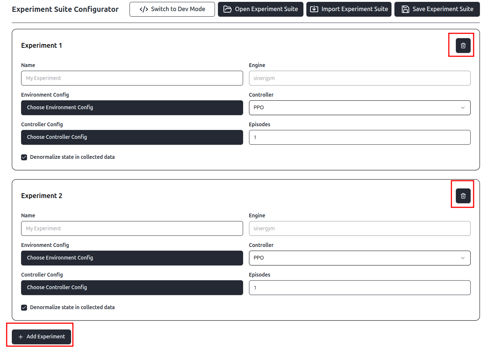
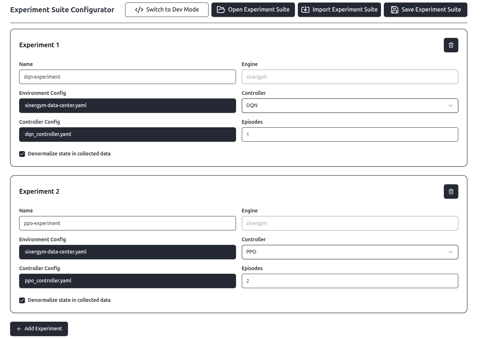

# Overview


Experiment configuration relies on `.yaml` files. To define an experiment, the following components are required:

-   **Controller config** (`.yaml`)
-   **Environment config** (`.yaml`)
-   **Experiment config** (`.yaml`)
-   **Building model** (`.epJSON`)
-   **Weather data** (`.epw` and `.ddy` files)

The building model and weather data must be provided by the user as external assets. The configuration files, however, can be either authored manually or generated automatically using the Frontend interface.

# Configuration with Frontend

To access the frontend, start the application via Docker (see README in project root) and access `http://localhost:5173/`. To create 

## Environment Configuration

In the menubar at the top, navigate to `Configurators` / `Environment` and you will see this screen:



On the top, you have a bar with different options:

- Switch to Dev Mode: Opens the plain yaml file that you are updating under the hood. You can switch between Dev Mode and GUI mode without loosing your current progress, are changes are reflected in both views
- Open Configuration: Opens a dialog that allows you to previous created environment configuration
- Import Configuration: Allows you to import a configuration from any location of you system into the project.
- Save Configuration: Allows you to store the configuration in the system. 

### General

In the general tab, you can configure general environment properties:

- Building Model: Click on the button `Select Building Model` to select a building model. You select building models (`.epJSON` files) that have previously been placed in the folder `data/environment/buildings`. 
- Weather Data: Click on the button `Select Weather Data` to select weather data. You can select wather data that have previously been placed in the folder `data/environment/weather` in it's own folder. Every weather data folder must contain a `.ddy` and `epw` file.
- Start Date Episode: Selects the date on which each experiment episodes will start.
- End Date Episode: Selects the date on which each experiment episode will end.
- Timesteps per hour: Select how many timesteps per hour are simulated.

### State Space

In the state space tab, you can configure your state space. On the top, you can choose if you want to add time information and specify which information you want. Furthermore, you can choose if the time information should be cyclic. For information on cyclic time data can be found [here](https://towardsdatascience.com/how-to-handle-cyclical-data-in-machine-learning-3e0336f7f97c/).

In the `Variables` section, you can define the variables that are present in your state  space. They are mapped to a sinergym state space and have to be present as output variables in the `epJSON` energy plus building model file. More information can be found [here](https://ugr-sail.github.io/sinergym/compilation/main/pages/environments)

 You can specify
- Variable Name: The internal name used in the platform for this variable
- The type: `Variable` or `Meter`. If you choose `Meter`, the only thing that is needed in addition is the meter name. If you choose `Variable` you must also give the EnergyPlus Name and the Zone 
- EnergyPlus Name: The variable name in EnergyPlus. This variable has to be present to make the framework work.
- Zone: EnergyPlus Zone (or object) in which the variable is. This must map to the value `key_value` in output variables in the `epJSON` building model.
- Exclude from state space: It this is ticket, the value of this variable will not be forwarded to the agent as part of the state space. However, the value is measured and is present in the resulting dataset.

You can add and remove state space variable by clicking on the corresponding buttons:



### Action space

For the action space, you can define actuators. They are mapped to a sinergym action space and have to be present as in the `epJSON` energy plus building model file. More information can be found [here](https://ugr-sail.github.io/sinergym/compilation/main/pages/environments)

You must specify:

- Actuator Name: The internal name used in the platform for this actuator
- Component: Energy plus component name
- Control Type: The Energy Plus control type
- Actuator Key: The Energy Plus key for this actuator
- Type: Here you can either choose `Continuous` or `Discrete`
    - For `Continuous`, you can choose Min and Max value. A value out of the continuous range [min, max] will then be applied at each timestep by the agent for this actuator. Values outside will be clipped to this range.
    - For `Discrete`, you can choose for the mode `Values` or `Ranges`. If you choose values, you can give a list of values from which the agent might choose it's action. If you choose `Range`, you can give a `Min` and `Max` values and a step size. So for example the values min = 20, max = 21, range = 0.2 will result in [20, 20.2, 20.4, 20.6, 20.8, 21]

Here is an example of an action space configuration:



### Reward

In general, you have two different options how to configure a reward: Expression or code base. You can choose the type you want to use in the `Type` combobox

#### Expression reward

In the `Variables` section, you can give a list of state space variable names. These variables are then available in the `Expression` section and their value will be used by the reward function at each timestep.

In the `Parameter` section, you can define custom parameters. There value will be used by the reward function at each timestep.

Finally, you have to define a custom expression in the `Expression` section.

#### Expression reward

In the `Variables` section, you can list state space variable names. These variables are then available in the `Expression` section, and their values will be updated at each timestep for the reward calculation.

In the `Parameter` section, you can define custom parameters. Their values are constant and available to the reward function at each timestep.

Finally, you have to define a custom expression in the `Expression` section. This expression is a mathematical formula that calculates the reward using the variables and parameters you defined.

The expression uses **Python-like syntax** and is evaluated safely using the **[asteval](https://newville.github.io/asteval/)** library. You can use standard arithmetic operators (`+`, `-`, `*`, `/`, `**`) and parentheses.

Additionally, the following specific functions are available for use in your formula:

- **Standard Math**: `abs(x)`, `min(a, b)`, `max(a, b)`, `exp(x)`, `sqrt(x)`
- **Numpy Utilities**: `clip(value, min, max)`
- **Custom Logic**: `within(x, start, end)`
  - *Description*: Checks if `x` is between `start` and `end`.
  - *Wrap-around*: It handles wrap-around ranges automatically (e.g., `within(month, 11, 2)` returns True for Nov, Dec, Jan, Feb).

**Example:**
To penalize energy consumption while keeping temperature within comfortable bounds (20°C to 24°C):

```python
-1.0 * energy_consumption + (10.0 if within(zone_temp, 20, 24) else -10.0)
```

Example of an expression reward:



#### Code-based reward

To overcome limitations of expression rewards, you can also use code based rewards. For this, you can give the python module name and the python class name of your reward class. More information about how to add such a customized reward can be found here [05-extending-the-system](05-extending-the-system.md)

### Example YAML file

```yaml
building_model: >-
  /home/johannes/workspace/rl-building-control/data/environment/buildings/2ZoneDataCenterHVAC_wEconomizer.epJSON
weather_data: >-
  /home/johannes/workspace/rl-building-control/data/environment/weather/ny_jfkl/USA_NY_New.York-J.F.Kennedy.Intl.AP.744860_TMY3.epw
state_space:
  variables:
    Outdoor Temperature:
      type: Site Outdoor Air Drybulb Temperature
      zone: Environment
    East_Zone_Temperature:
      type: Zone Air Temperature
      zone: East Zone
    Outdoor Humidity:
      type: Site Outdoor Air Relative Humidity
      zone: Environment
    Wind Speed:
      type: Site Wind Speed
      zone: Environment
    Diffuse Solar Radiation:
      type: Site Diffuse Solar Radiation Rate per Area
      zone: Environment
    Direct Solar Radiation:
      type: Site Direct Solar Radiation Rate per Area
      zone: Environment
    West_Zone_Temperature:
      type: Zone Air Temperature
      zone: West Zone
    East Humidity:
      type: Zone Air Relative Humidity
      zone: East Zone
    West Humidity:
      type: Zone Air Relative Humidity
      zone: West Zone
    West Mean Radiant Temp:
      type: Zone Thermal Comfort Mean Radiant Temperature
      zone: West Zone PEOPLE
    East Mean Radiant Temp:
      type: Zone Thermal Comfort Mean Radiant Temperature
      zone: East Zone PEOPLE
    Fanger West:
      type: Zone Thermal Comfort Fanger Model PPD
      zone: West Zone PEOPLE
    Fanger East:
      type: Zone Thermal Comfort Fanger Model PPD
      zone: West Zone PEOPLE
    People Air Temp West:
      type: People Air Temperature
      zone: West Zone PEOPLE
    People Air Temp East:
      type: People Air Temperature
      zone: East Zone PEOPLE
    East Zone People:
      type: Zone People Occupant Count
      zone: East Zone
    West Zone People:
      type: Zone People Occupant Count
      zone: West Zone
    Facility_Total_HVAC_Electric_Demand_Rate:
      type: Facility Total HVAC Electricity Demand Rate
      zone: Whole Building
    Cooling_Setpoint:
      type: Zone Thermostat Cooling Setpoint Temperature
      zone: West Zone
    Heating_Setpoint:
      type: Zone Thermostat Heating Setpoint Temperature
      zone: West Zone
    Fanger Model Clothing Value:
      type: Schedule Value
      zone: Clothing Sch
  time_info:
    day_of_month:
      cyclic: false
    month:
      cyclic: true
    day_of_week:
      cyclic: false
    hour:
      cyclic: false
action_space:
  actuators:
    Cooling Setpoint:
      type: continuous
      range:
        - 22
        - 30
      component: Schedule:Constant
      control_type: Schedule Value
      actuator_key: Cooling Setpoint RL
    Heating Setpoint:
      type: continuous
      range:
        - 15
        - 22
      component: Schedule:Constant
      control_type: Schedule Value
      actuator_key: Heating Setpoint RL
reward_function:
  type: expression
  variables:
    - East_Zone_Temperature
    - West_Zone_Temperature
    - Facility_Total_HVAC_Electric_Demand_Rate
  expression: >-
    - energy_weight * lambda_energy * Facility_Total_HVAC_Electric_Demand_Rate -
    (1 - energy_weight) * lambda_temperature * (max(0, ((East_Zone_Temperature +
    West_Zone_Temperature) / 2) - comfort_high) + max(0, comfort_low -
    ((East_Zone_Temperature + West_Zone_Temperature) / 2)))
  params:
    energy_weight: 0.5
    lambda_energy: 0.00005
    lambda_temperature: 1
    comfort_high: 27
    comfort_low: 18
episode:
  timesteps_per_hour: 4
  period:
    - 1
    - 1
    - 2025
    - 31
    - 12
    - 2025
```

## Controller configuration

In the menubar at the top, navigate to `Configurators` / `Controller` and you will see this screen:



You can use the same controls as in the environment configurator to switch to dev mode, open a configuration, import a configuration and save a configuration.

You can choose between three different types of controllers: Reinforcement learning, Rule based and custom

### Reinforcement Learning Controller

#### Training options

You can configure the following training option:

- Total Training Timesteps: The total number of training timesteps the agent will do in the training phase.
- Report Training: If this it ticket, data is collected during training and is available in the final dataset.
- Denormalize: If state or action normalization is ticket, you can control with denormalize of the values are stored in the final dataset in denormalized form.
- Tensorboard Logs: Defines if during training, data is sent to [Tensorboard](https://www.tensorflow.org/tensorboard) for monitoring the training process. If this is ticket, you can open tensorboard and see the training metrics during training. More information you can get [here](02-running-experiments.md).

#### Hyperparameter tuning

If `Activate Hyperparameter tuning` is ticket, hyperparameter tuning using [Optuna](https://optuna.org/) is activated. You have to specify the following options:

- Num episodes: Total number of episodes are used for evaluation during hyperparameter tuning.
- Num trails: The number of different trials used during hyperparameter tuning.
- Sampler: You can choose the (sampler used by Optuna)[https://optuna.readthedocs.io/en/stable/reference/samplers/index.html]. The options are `TPE`, `Random`, `Grid`, `CMAES`, and `NSGAII`. Note that the chosen RL algorithm must support hyperparameter tuning. More information on this can be found [here](05-extending-the-system.md).
- Training timesteps: The total number of training timesteps used during hyperparameter tuning.

#### Environment wrapper

You can choose different environment wrappers 

- Normalize state: Determines if the state space is normalized
- Normalize reward: Determines if the reward value is normalized
- Normalize action: Determines if the action space is normalized
- Continuous action: Determines if the action space is continuous - must be ticket for controllers that support a continuous action space
- Discrete action:  Determines if the action space is discrete - must be ticket for controllers that support a discrete action space (e.g. DQN)

#### Hyperparameters

Lets you specify a hyperparameter name and it's value.
You can also give nested hyperparameters, for example `policy_kwargs.squash_output`.

#### Example

Here is an example configuration of a A2C reinforcement learning controller.




Example yaml file:

```yaml
training:
  report_training: false
  report_denormalized_state: false
  tensorboard_logs: true
  timesteps: 300000
environment_wrapper:
  normalize_state: true
  normalize_reward: false
  normalize_action: true
  continuous_action: true
  discrete_action: false
hyperparameters:
  tensorboard_log: logs/
  ent_coef: 0.01
  learning_rate: 0.00005
  n_steps: 512
  gae_lambda: 0.95
  vf_coef: 0.5
  policy_kwargs.squash_output: true
```

### Rule based Controller

For rule-based controllers, you must provide the following configuration:

- Custom Variables: You can add a list of key value pairs, that you can later use in your rules and actions
- State Space: If you are **NOT** using a sinergym environment, you must add **all** variables names of the state space. At the moment, the platform supports only sinergym environments, so **you do not have to add anything here**.
- Rules: You must provide conditions and actions by using **Python-like syntax** and which is evaluated safely using the **[asteval](https://newville.github.io/asteval/)** library
    - Condition: Condition that evaluates to a boolean value
    - Action: If the corresponding condition evaluates to `true`, this action is returned and send to the actuators. Make sure that the dimension of the action matches your action space

#### Examples:


Resulting yaml file:

```yaml
custom_variables:
  high: 27
  low: 18
  cooling_min: 22
  cooling_max: 27
  heating_min: 18
  heating_max: 22
rules:
  - condition: ((East_Zone_Temperature + West_Zone_Temperature) / 2) > high
    action: >-
      [clip(Cooling_Setpoint - 1, cooling_min, cooling_max),
      clip(Heating_Setpoint - 1, heating_min, heating_max)]
  - condition: ((East_Zone_Temperature + West_Zone_Temperature) / 2) < low
    action: >-
      [clip(Cooling_Setpoint + 1, cooling_min, cooling_max),
      clip(Heating_Setpoint + 1, heating_min, heating_max)]
  - condition: 'True'
    action: >-
      [clip(Cooling_Setpoint, cooling_min, cooling_max), clip(Heating_Setpoint,
      heating_min, heating_max)]
```

### Custom controller

To overcome possible limitations, you can use your own custom implementation of a controller. For this, you can specify the python module name and the python class name of your controller class. In addition, you can define in `init arguments` key value pairs that are passed to your custom controller.

 More information about how to add such a customized reward can be found here [05-extending-the-system](05-extending-the-system.md)

Example yaml file: 

```yaml
class_name: MyCustomController
module: controllers.custom.my_custom_controller
args:
  factor: 1
  lower_bound: 20
  upper_bound: 25

```

## Experiment suite configuration

In the menubar at the top, navigate to `Configurators` / `Experiment`. You will see the same controls for switching to dev mode, open a experiment suite, import an experiment suite and save an experiment suite as for environment and controller configuration.

You can add/remove an experiment to/from an experiment suite by using the corresponding buttons as shown in this screenshot:



Per experiment, you can configure:

- Name: Internal name of the experiment
- Engine: Engine on which the experiment runs. At the moment, the only supported engine is [sinergym](https://github.com/ugr-sail/sinergym)
- Environment config: `.yaml` configuration file of the environment
- Controller: Type of the controller. For Reinforcement Learning Controllers, this correspond to the used model. At the moment, the following controller types are available:
    - Custom
    - Random (just chooses random actions)
    - Rule based
    - SAC
    - PPO
    - Recurrent PPO
    - A2C
    - DQN
    - DDPG
    - TD3
- Controller Config: `.yaml` configuration file of the controller. Make sure that the hyperparameter used in the `.yaml` file match the supported hyperparameters of the chosen RL model.
- Episodes: Number of episodes used during evaluation.
- Denormalize State in collected data: If ticket, denormalized state and action space will be recorded during evaluation. The recommendation is to tick this

### Example Config:

Using the GUI:



Resulting `.yaml` file:

```yaml
experiments:
  - name: dqn-experiment
    engine: sinergym
    environment_config: sinergym-data-center.yaml
    controller: dqn
    controller_config: dqn_controller.yaml
    episodes: 1
    reporting:
      denormalize_state: true
  - name: ppo-experiment
    engine: sinergym
    environment_config: sinergym-data-center.yaml
    controller: ppo
    controller_config: ppo_controller.yaml
    episodes: 2
    reporting:
      denormalize_state: true
```

