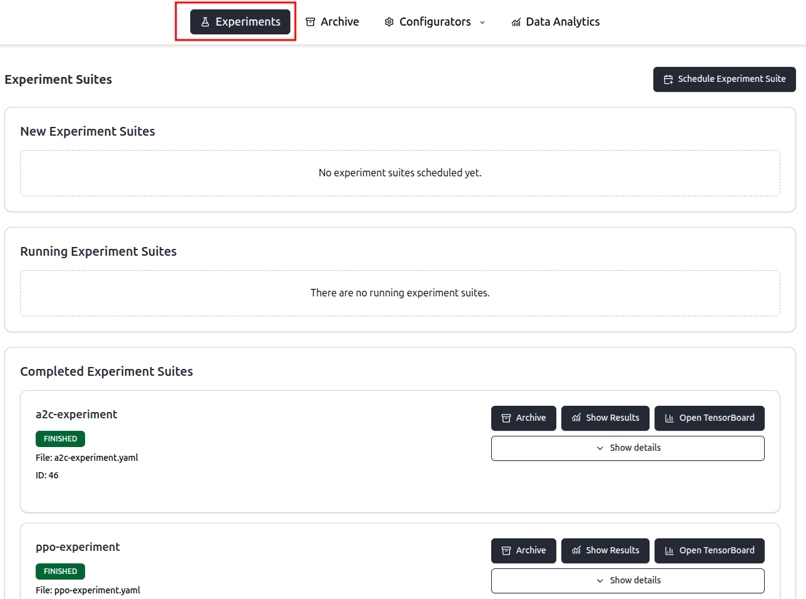
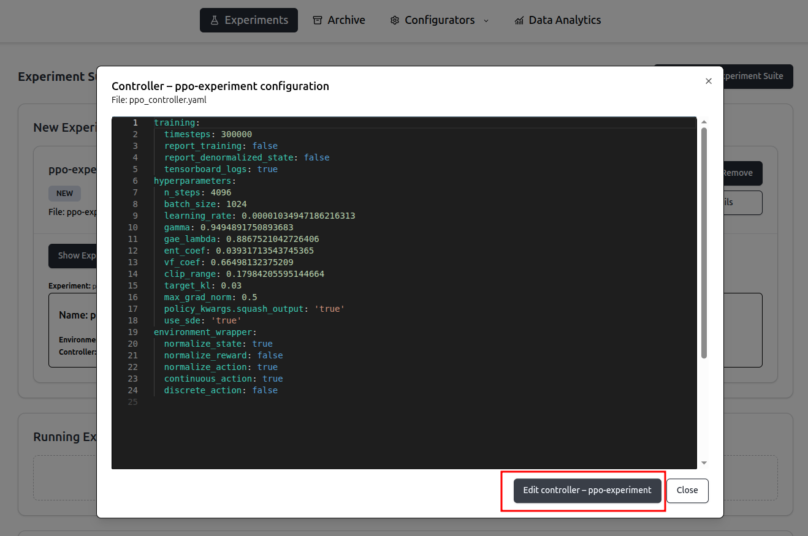
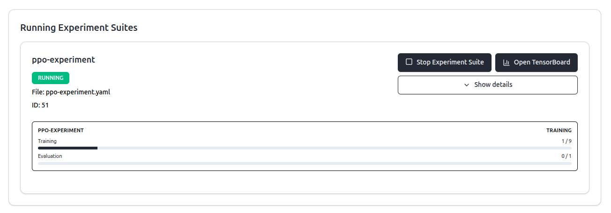
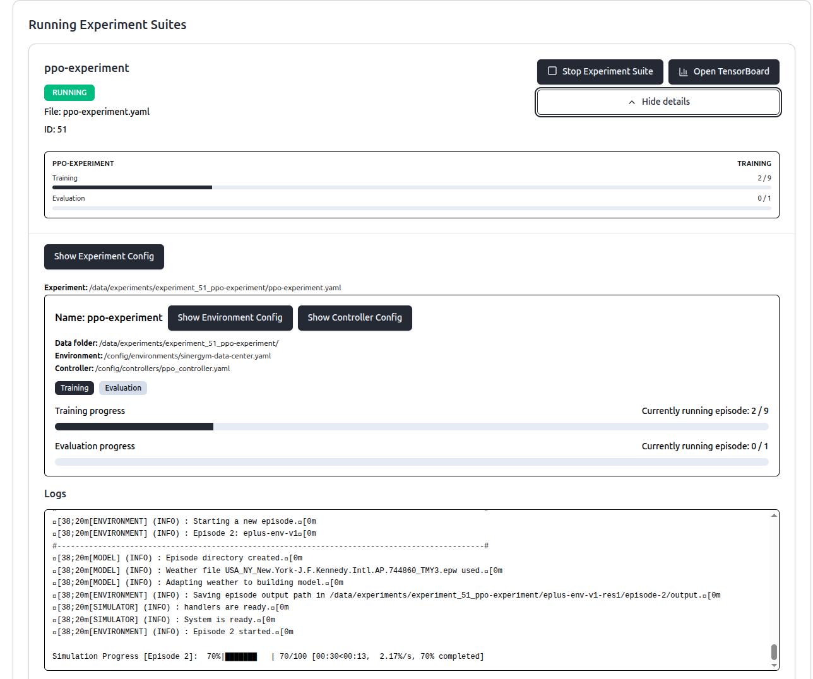
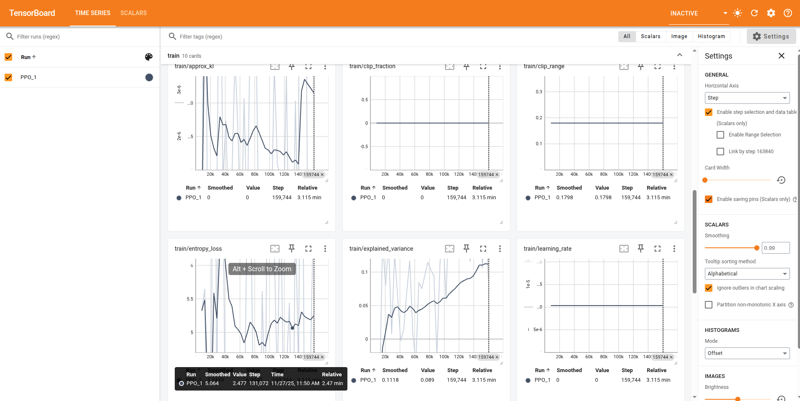
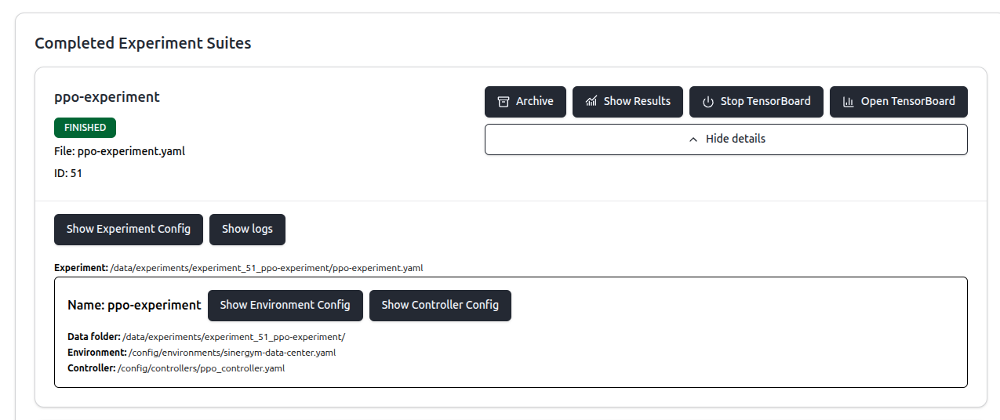

# Experiment Execution using GUI

To access the frontend, start the application via Docker (refer to the README in the project root) and navigate to `http://localhost:5173/`. Select `Experiments` from the top navigation bar:

The page is divided into three sections:
- **New Experiment Suites**: Displays experiment suites that have been scheduled but not yet executed.
- **Running Experiment Suites**: Displays experiment suites that are currently in progress.
- **Completed Experiment Suites**: Displays experiments that have finished or were aborted.

## Scheduling an Experiment Suite

To schedule a new experiment, click `Schedule Experiment Suite`. A dialog will appear displaying all stored experiment suites. Experiment suites can be created as described [here](01-experiment-configuration.md).

After scheduling an experiment suite, additional details, including the `.yaml` configuration files for individual experiments, can be viewed by clicking `Show details`. When reviewing `.yaml` files, use the buttons at the bottom to navigate to the respective configurator page for modifications:

To commence the experiment suite, click `Run`.

## Running an Experiment

Upon starting an experiment via the `Run` button, an overview displaying the current status will appear:

Clicking `Show details` reveals additional information:

For each experiment, detailed information is provided, including configuration files, status, and live execution logs. Clicking `Open Tensorboard` launches the corresponding [TensorBoard](https://www.tensorflow.org/tensorboard) instance for viewing live training metrics:

To terminate a TensorBoard instance, click `Stop Tensorboard`.

To halt the entire experiment suite, click `Stop Experiment Suite`.

## Completed Experiments

Upon completion, experiments appear in the **Completed Experiment Suites** section.

Experiments can be archived to remove them from the dashboard (they remain accessible in the `Archive` section). From the archive section, you can either see their data again or delete them.

TensorBoard logs remain available and can be viewed in [TensorBoard](https://www.tensorflow.org/tensorboard). Clicking `Show results` navigates to the `Data Analysis` page, which provides a detailed analysis of the results (described [here](03-data-analysis.md)).

Clicking `Show Details` provides options to view individual `.yaml` configuration files or execution logs.

# Execution without GUI

Experiment suites can also be executed using the testbed, as described [here](../../testbed/README.md).
