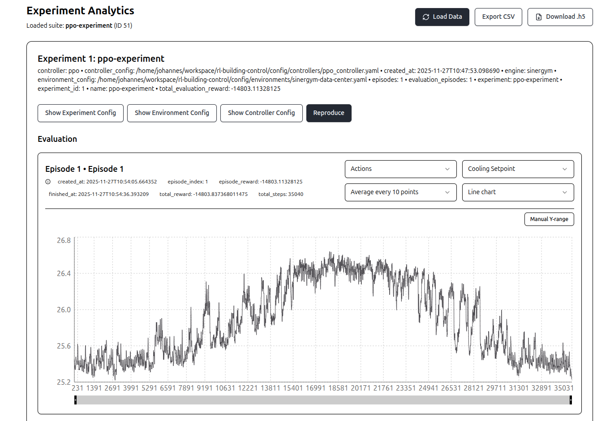
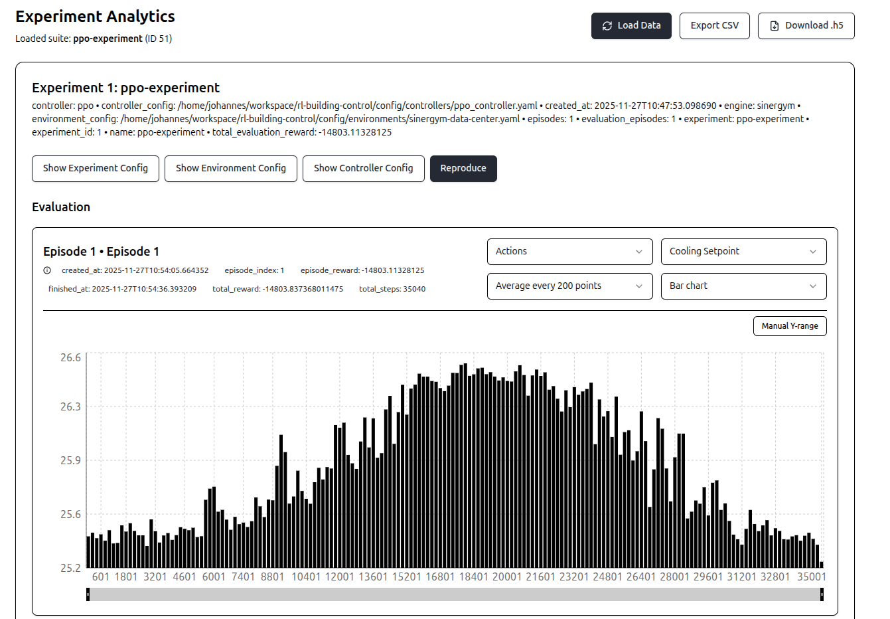
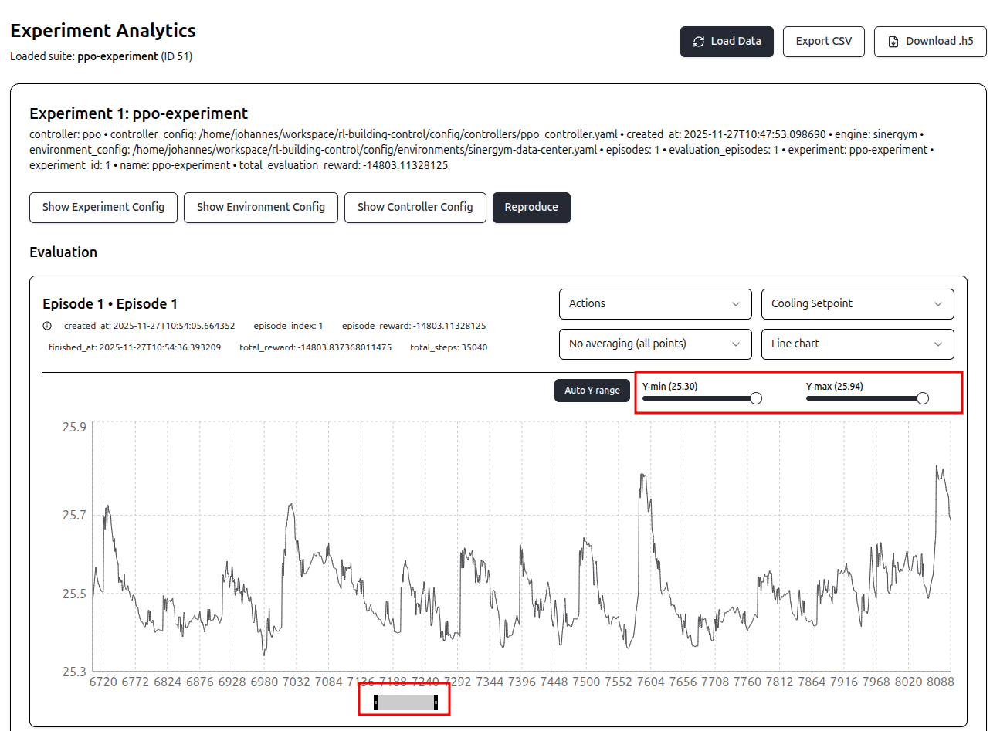
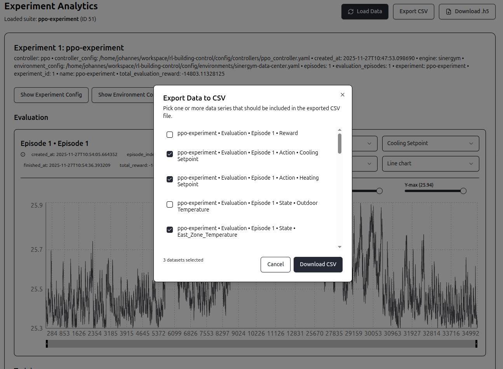

# Data Analysis

To access the frontend, start the application via Docker (see README in project root) and access `http://localhost:5173/`. Navigate via the top bar to `Data Analysis` or open click on `Show Results` in the `Experiments` dashboard ([more information](02-running-experiments.md)):

## Data Analysis in GUI

You can open experiment data via the button `Load Data`. For each experiment in the experiment suite, you will get an overview on the results:

On the top of the card, you can see some information for the experiment, like the config `.yaml` files used or the total reward collected during evaluation.

For each experiment, you have four buttons:

- Show Experiment Config: Shows the experiment config used
- Show Environment Config: Shows the environment config used
- Show Controller Config: Shows the controller config used
- Reproduce: Creates a new experiment in the `Experiments` section, with exactly the same configuration and environment data (building model, weather data). This allows to reproduce the experiment. 

For each episode, you see some general information including the created timestamp, finished timestamp and total reward. Below, you see a visualization of the data. You can choose, which variable is shown in the data visualization. There are three categories:
- Reward: Shows the reward for each timestep in the episode.
- Actions: Allows you investigate for each actuator the taken action per timestep.
- States: Allows you to investigate for each variable in the state space the measured value for each timestep.
You can also control how smooth the chart looks by adjusting the averaging frequency. You can set this to occur every 5, 10, 20, 50, 100, 200, or 500 timesteps. In addition, you can choose if the data is presented in a line chart, a bar chart or in a table view.

This screenshot shows the same data as in the screenshot before but this time presented as bar chart with averaging every 200 timesteps.

You can also adjust the range of the y-axis and x-axis to investigate a data section in more detail. Here, we only look at cooling setpoints between 25.3 and 25.94 degrees for timesteps between 7150 and 7250 :

The same data analysis tool is also available for the data collected during the training process (if this was enabled in the config file).

## CSV Export

You can export data to a `.csv` file by clicking on `Export CSV` on the top of the screen. A dialog opens in which you can choose which variables you want to be included in the resulting dataset:

## Download .h5

YOu can export the underlying `.h5` file ([HDF 5 - based file](https://www.hdfgroup.org/solutions/hdf5/)) that contains all information of the experiment, including

- Context data
    - All `.yaml` files used for configuration
    - The used building model `.epJSON`
    - The used weather data (`.ddy` and `.epw`) files
- Evaluation data
    - Action taken by all actuators at each timestep
    - Reward for each timestep
    - Values for all variables configured in the state of the environment
- Training data
    - Action taken by all actuators at each timestep
    - Reward for each timestep
    - Values for all variables configured in the state of the environment

By also containing context information, the `.h5` file does not only contain all results but also the information needed to reproduce them. We can view it as "self contained experiment data".