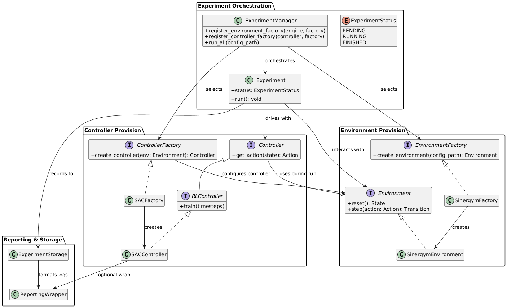

# General Overview

Here you can see a general overview of the base classes to gain an understanding how the individual parts work together:



Nte, that this is not a detailed view on all interfaces available, it should give you a basic idea of the architecture. For controllers, it shows an exemplary SAC controller.

# Environment

To add a new environment, you must inherit from the abstract class `IEnvironmentFactory` and implement one method:

```python
 def create_environment(self) -> gym.Env:
```

The framework passes the path to a given config file automatically to the `EnvironmentFactory` class. You can access it with `self.config_path`. 

The environment that is returned must follow the [Gymnasium Env API](https://gymnasium.farama.org/api/env/).

# Permanent Controller

To add a new controller, you must inherit from the `ControllerFactory` abstract class and implement one method:

```python
def create_controller_setup(self) -> ControllerSetup:
```

The framework passes the path to a given config file automatically to the `ControllerFactory` class. You can access it with `self.config_path`. 

The ControllerSetup object looks like this:

```python
class ControllerSetup(NamedTuple):
    controller: Controller
    environment: gym.Env
```

You can generate the environment using the `self.env_factory` by calling `self.env_factory.create_environment()`. For the controller, you must provide a custom implementation that inherits from the abstract class `Controller`.

You have to implement only one method:

```python
def get_action(self, state: Any) -> Any:
```

## RL Controller

If you want to create a Reinforcement Learning based controller, you can inherit from the abstract class `RLControllerFactory` that return as controller a `RLController` instance.  

For the `RLControllerFactory`, you must implement in addition the method `build_controller`:

```python
def build_controller(self, env: gym.Env, hyper_params: Dict, **kwargs) -> RLController:
```

For `RLController`, you must implement in addition the method contains in addition the method `train`:

```python
def train(self, timesteps: int):
```

You can use the method

```python
def create_rl_controller_setup(
    self,
    hp:Optional[Dict[str, Any]],
    env_wrap_manager: EnvWrapperManager,
    is_adapter: bool = False,
) -> ControllerSetup:
```

to automate the environment wrapping, hyperparameter tuning and training steps.

## Tunable RL Controller 

If you want to enable automatic hyperparameter tuning, you must implement for the factory the abstract class `HPTunableControllerFactory` and implement two additional methods:

```python
def suggest_hyperparameters_space(self, trial: Optional[optuna.Trial] = None) -> Dict[str, Any]:

def get_grid_search_space(self) -> Dict[str, List[Any]]:
```
## Registering

Once you have implemented the Controller Factory, you must register the class in the `experiment_manager` in the file `main.py` like this:

```python
experiment_manager.register_controller_factory("sac", SACFactory())
```

To make the controller also available in the frontend, add a entry in the file `controllers.json` in the folder `frontend/public` like this:

```json
{
  "key": "sac",
  "name": "SAC"
},
```

The key must match the key you passed to the experiment manger.

## Example of a tunable RL controller:

```python
from typing import Any, Dict, Optional, List

import gymnasium as gym
import optuna
from gymnasium import Env
from stable_baselines3 import SAC

from controllers.base_controller import ControllerSetup
from controllers.base_hp_tunable_controller import HPTunableControllerFactory
from controllers.base_rl_controller import (
    RLController,
    load_rl_controller_config,
)
from tuning.hp_tuning import tune_hp
from wrappers.manager import EnvWrapperManager


class SACController(RLController):

    def __init__(self, env: gym.Env, params: Dict):
        super().__init__(env)

        self.model = SAC("MlpPolicy", env, **params)

    def get_action(self, state: Any) -> Any:
        action, _ = self.model.predict(state)
        return action

    def train(self, timesteps: int):
        # Set log_interval to 1 to increase support for tensor graph integration (more regular logs).
        self.model.learn(total_timesteps=timesteps, log_interval=1)


class SACFactory(HPTunableControllerFactory):

    def get_grid_search_space(self) -> Dict[str, List[Any]]:
        return {
            "learning_rate": [1e-5, 5e-5, 1e-4, 5e-4, 1e-3],
            "gamma": [0.9, 0.95, 0.98, 0.99, 0.995],
            "batch_size": [32, 64, 128, 256],
            "ent_coef": ["auto_0.5", "auto_1.0", "auto_2.0"],
            "tau": [0.005, 0.01, 0.02],  # target smoothing coefficient
            "train_freq": [1, 2, 4],  # how often to update (per step)
            "gradient_steps": [1, 2, 4],  # how many gradient steps per update
            "target_update_interval": [1, 10],  # how often to update target network
        }

    def suggest_hyperparameters_space(self, trial: Optional[optuna.Trial] = None) -> Dict[str, Any]:
        if trial is None:
            return {
                "ent_coef": "auto_2.0",
                "learning_rate": 0.0009851008761417273,
                "gamma": 0.9305074409820552,
                "batch_size": 32,
                "tau": 0.005,
                "train_freq": 1,
                "gradient_steps": 1,
                "target_update_interval": 1,
            }

        ent_coef_scale = trial.suggest_float("ent_coef_scale", 0.3, 3.0)
        return {
            "learning_rate": trial.suggest_float("learning_rate", 1e-5, 1e-3, log=True),
            "gamma": trial.suggest_float("gamma", 0.9, 0.9999, log=True),
            "batch_size": trial.suggest_categorical("batch_size", [32, 64, 128, 256, 512]),
            "ent_coef": f"auto_{ent_coef_scale}",
            "tau": trial.suggest_float("tau", 0.001, 0.02, log=True),
            "train_freq": trial.suggest_categorical("train_freq", [1, 2, 4, 8]),
            "gradient_steps": trial.suggest_categorical("gradient_steps", [1, 2, 4, 8]),
            "target_update_interval": trial.suggest_categorical(
                "target_update_interval", [1, 5, 10]
            ),
        }

    def build_controller(self, env: Env, hyper_params: Dict, **kwargs) -> SACController:
        return SACController(env, hyper_params)

    def create_controller_setup(self) -> ControllerSetup:
        if self.config_path is None or self.config_path == "":
            raise RuntimeError("No configuration was provided for the SAC controller.")

        config = load_rl_controller_config(self.config_path)

        # This controller relies on a continuous action space.
        config.environment_wrapper.discrete_action = False
        config.environment_wrapper.continuous_action = True

        env_wrap_manager = EnvWrapperManager([], config.environment_wrapper)

        hp = config.hyperparameters

        if config.hyperparameter_tuning is not None and config.hyperparameter_tuning.enabled:
            hp = tune_hp(
                self,
                hp_tuning_config=config.hyperparameter_tuning,
                env_wrapper_manager=env_wrap_manager,
                is_env_adapter=False,
                hp=config.hyperparameters,
            )

        return super().create_rl_controller_setup(hp, env_wrap_manager)
```

# Custom Controller

In contrast do adding a controller permanently, you can also provide a implementation of the `Controller` abstract class. This is much faster than providing the full factory. This is also explained [here](01-experiment-configuration.md#custom-controller). An example of such an controller could be like this:

```python
class MyCustomController(Controller):
    """
    Example custom controller, that scales the action by a given factor while respecting given bounds
    """

    def __init__(self, **kwargs: Any):
        super().__init__(**kwargs)
        self.factor = kwargs.get("factor", 1.0)
        self.lower_bound = kwargs.get("lower_bound", 16.0)
        self.upper_bound = kwargs.get("upper_bound", 28.0)

    def get_action(self, state: Any) -> Any:
        sample = self.env.action_space.sample()

        clipped_action = tuple(
            np.clip(
                action_array * self.factor,  # Scale the individual NumPy array
                self.lower_bound,
                self.upper_bound,
            )
            for action_array in sample
        )
        return clipped_action
```

The corresponding config could look like this:

```yaml
class_name: MyCustomController
module: controllers.custom.my_custom_controller
args:
  factor: 1
  lower_bound: 20
  upper_bound: 25
```

# Custom Reward

To add a custom reward, you must implement the `BaseReward` interface form [sinergym](https://ugr-sail.github.io/sinergym/compilation/main/pages/rewards.html). As you can see, this reward concept for the moment only working when using a sinergym environment.

An example implementation of a custom reward could look like this:

```python
class MyReward(BaseReward):
    def __init__(self, target_temp=23.0, sigma=1.0, smooth_action_penalty=0.0):
        super().__init__()
        self.target_temp = target_temp
        self.sigma = sigma  # Controls sharpness of the reward peak
        self.smooth_action_penalty = smooth_action_penalty  # weight for penalizing large jumps

    def __call__(self, reward_dict):

        temp = reward_dict.get("air_temp_101", 0.0)
        deviation = abs(temp - self.target_temp)

        # Gaussian reward centered at 23°C
        comfort_score = np.exp(-((temp - self.target_temp) ** 2) / (2 * (self.sigma**2)))
        reward = 2.0 * comfort_score - 1.0  # Range: [-1, +1]

        return reward, {
            "temp": temp,
            "reward": reward,
            "deviation": deviation,
            "comfort_score": comfort_score,
        }
```

The corresponding section in the environment config might look like this:

```yaml

reward_function:  
  type: "python"
  module: "reward.custom_reward"  
  class_name: "MyReward"  
  init_args:  
    target_temp: 23.0  
    sigma: 1.2  
    smooth_action_penalty: 0.05

```

